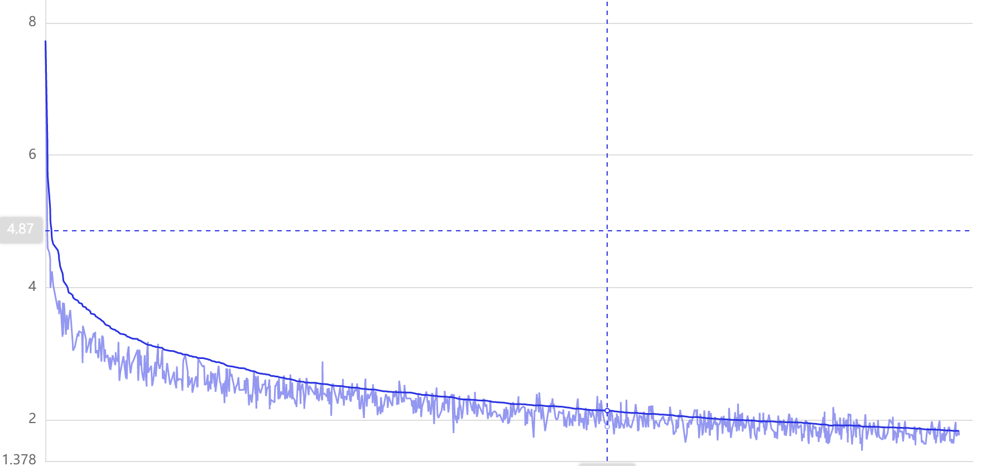

## ContextPrior_Paddle

### 一、简介

ContextPrior Architecture

> 论文原文：[2004.01547.pdf ](https://arxiv.org/pdf/2004.01547.pdf)


具体网络说明可以移步到本人博客，曾写有论文笔记[ContextPrior论文阅读笔记](https://blog.puqing.work/p/context-prior-for-scene-segmentation%E8%AE%BA%E6%96%87%E9%98%85%E8%AF%BB%E7%AC%94%E8%AE%B0/)

本项目利用百度的paddlepaddle框架对CVPR2020论文context prior for scene
segmentation的复现。项目依赖于paddleseg工具，因此可以使用paddleseg中提供的训练和评估API进行训练与评估。

### 二、复现精度及loss图



| Model                | mIOU  |
| -------------------- | ----- |
| CPNet50(原论文mmseg) | 44.46 |
| CPNet50              | 45.37  |

### 三、数据集

使用的数据集为：[ADE20K](https://groups.csail.mit.edu/vision/datasets/ADE20K/)

> 注：paddleseg提供ADE20K在线下载以及解压，详情请看[paddleseg开发文档](https://paddleseg.readthedocs.io/zh_CN/release-2.1/apis/transforms/datasets.html#ADE20K)

- Training set：20.210 images
- Validation set：2.000 images

### 四、环境依赖

- 硬件：GPU、CPU
- 框架： PaddlePaddle-GPU
- 开发套件：PaddleSeg

### 五、快速开始

#### step0:clone

``
git clone git@github.com:AndPuQing/ContextPrior_Paddle.git
``

#### step1:安装必要依赖

``
pip install -r requirements.txt
``

#### step2:训练

具体参数可在train.py中查看修改

``
python train.py
``

#### step3:评估

利用预训练模型进行验证集的评估

``
python eval.py
``

### 六、代码结构与详细说明

```
├── README.md
├── models/ # 模型定义
├── loss/ # 自定义损失函数
├── tool/ # 工具
├── train.py # 训练
├── eval.py # 评估
```
