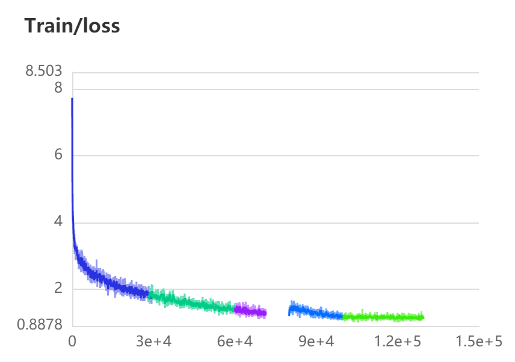

# CPNet

[English](./README.md) | 简体中文

   * [CPNet](#cpnet)
      * [一、简介](#一简介)
      * [二、复现精度](#二复现精度)
      * [三、数据集](#三数据集)
      * [四、环境依赖](#四环境依赖)
      * [五、快速开始](#五快速开始)
         * [step1: 训练](#step1-训练)
         * [step2: 评估](#step2-评估)
         * [step3: 测试](#step3-测试)
      * [六、代码结构与详细说明](#六代码结构与详细说明)
         * [6.1 代码结构](#61-代码结构)
         * [6.2 参数说明](#62-参数说明)
         * [6.3 训练流程](#63-训练流程)
            * [单机训练](#单机训练)
            * [多机训练](#多机训练)
            * [训练输出](#训练输出)
         * [6.4 评估流程](#64-评估流程)
         * [6.5 测试流程](#65-测试流程)
         * [6.6 使用预训练模型预测](#66-使用预训练模型预测)
      * [七、模型信息](#七模型信息)

## 一、简介

本项目基于PaddlePaddle框架复现CPNet，项目依赖于paddleseg工具，因此可以使用paddleseg中提供的训练和评估API进行训练与评估。

> 论文原文：[Context Prior for Scene Segmentation](https://openaccess.thecvf.com/content_CVPR_2020/papers/Yu_Context_Prior_for_Scene_Segmentation_CVPR_2020_paper.pdf)


**参考项目:**
- [https://github.com/ycszen/ContextPrior](https://github.com/ycszen/ContextPrior)

**项目AiStudio地址:**
- [NoteBook任务](https://aistudio.baidu.com/aistudio/projectdetail/2344133?contributionType=1&shared=1)
- [脚本任务]()(待完善...)

## 二、复现精度

> 该指标在ADE20K的测试集测试



| Model                | mIOU  |
| -------------------- | ----- |
| CPNet50(原论文mmseg) | 44.46 |
| CPNet50              | 45.37  |

### 三、数据集

使用的数据集为：[ADE20K](https://groups.csail.mit.edu/vision/datasets/ADE20K/)

> 注：paddleseg提供ADE20K在线下载以及解压，详情请看[paddleseg开发文档](https://paddleseg.readthedocs.io/zh_CN/release-2.1/apis/transforms/datasets.html#ADE20K)

- Training set：20.210 images
- Validation set：2.000 images

### 四、环境依赖

- 硬件：GPU、CPU
- 框架： PaddlePaddle-GPU
- 开发套件：PaddleSeg

### 五、快速开始

#### step0:clone

``
git clone git@github.com:AndPuQing/ContextPrior_Paddle.git
``

#### step1:安装必要依赖

``
pip install -r requirements.txt
``

#### step2:训练

具体参数可在train.py中查看修改

``
python train.py
``

#### step3:评估

利用预训练模型进行验证集的评估

``
python eval.py
``

### 六、代码结构与详细说明

```
├── README.md
├── models/ # 模型定义
├── loss/ # 自定义损失函数
├── tool/ # 工具
├── train.py # 训练
├── eval.py # 评估
```

### 七、Aistudio

[快速开始在AiStudio上训练验证](https://aistudio.baidu.com/aistudio/projectdetail/2344133?contributionType=1&shared=1)

1. 安装依赖

```bash
!pip install paddleseg --user
```

2. 训练

```bash
%cd /home/aistudio/work/openContext/
!python train.py
```

3. 验证

```bash
%cd /home/aistudio/work/openContext/
!python eva.py
```

